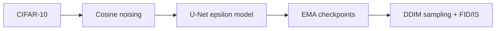

# Architecture

```mermaid
flowchart LR
    N0["CIFAR-10"] --> N1["Cosine noising"]
    N1["Cosine noising"] --> N2["U-Net epsilon model"]
    N2["U-Net epsilon model"] --> N3["EMA checkpoints"]
    N3["EMA checkpoints"] --> N4["DDIM sampling + FID/IS"]
    N4["DDIM sampling + FID/IS"]
```

## Claim boundary

Real model training and generation evaluation; throughput measured locally.
