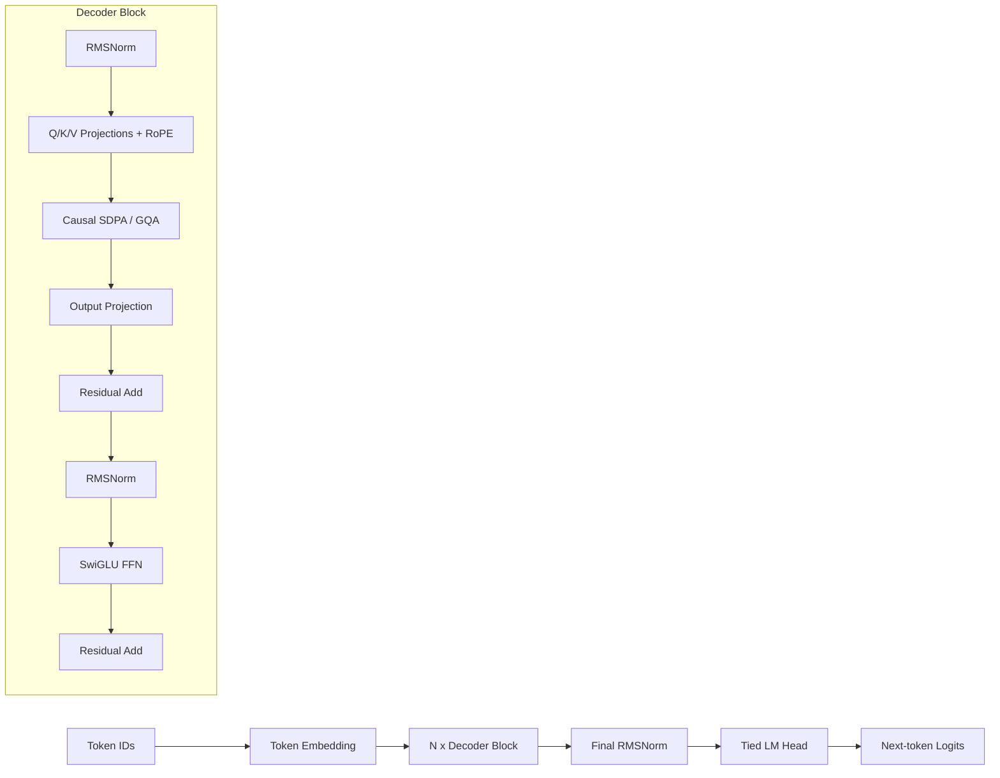

# Mini-GPT: Modern Decoder-Only Transformer

Mini-GPT is a compact GPT-style language model implemented in PyTorch with an emphasis on correctness, measurement, and interview-defensible systems work. The project now uses a modern LLaMA/Mistral-style decoder block while keeping the implementation small enough to audit.

## What I Implemented From Scratch

- Decoder-only causal language model with token embeddings, transformer blocks, tied LM head, next-token loss, and autoregressive generation.
- Causal self-attention with padding masks, KV cache support, and cache/non-cache equivalence tests.
- Modern transformer features: RoPE, PyTorch `scaled_dot_product_attention`, Grouped Query Attention, SwiGLU FFN, and RMSNorm.
- Training loop with gradient accumulation, AdamW, cosine warmup schedule, mixed precision, validation loss, perplexity, throughput, GPU memory, and JSONL/CSV experiment tracking.
- Evaluation script for WikiText-2, TinyStories, and OpenWebText-small.
- LoRA fine-tuning path with frozen base model and adapters on Q/K/V/O projections.
- Benchmark scripts for KV cache speedup and inference optimization.
- Unit tests for causal masking, logits shape, KV cache correctness, context length limits, and padding loss.

## Architecture



## Reproducible Commands

Install:

```bash
pip install -r requirements.txt
```

Run tests:

```bash
python -m pytest tests -q
```

Train on TinyStories:

```bash
python training/train_model.py --config configs/small_tinystories.yaml --dataset tinystories
```

Train a longer 20M-token TinyStories run:

```bash
python training/train_model.py --config configs/small_tinystories_20m.yaml --dataset tinystories
```

Continue from the best long-run checkpoint with a lower LR:

```bash
python training/train_model.py \
  --config configs/small_tinystories_continue_low_lr.yaml \
  --dataset tinystories \
  --init-from-checkpoint checkpoints/small_tinystories_20m/checkpoint_epoch_15.pt
```

Train on WikiText-2:

```bash
python training/train_model.py --config configs/small.yaml --dataset wikitext-2
```

Evaluate a trained checkpoint:

```bash
python training/evaluate.py \
  --checkpoint checkpoints/small_tinystories/model_final.pt \
  --config configs/small_tinystories.yaml \
  --dataset tinystories \
  --output reports/evaluation_tinystories.json
```

Benchmark KV cache:

```bash
python benchmark_kv_cache.py \
  --checkpoint checkpoints/small_tinystories/model_final.pt \
  --config configs/small_tinystories.yaml \
  --lengths 32 64 128 256 \
  --output reports/kv_cache_benchmark_tinystories.json
```

Benchmark inference:

```bash
python benchmark_inference.py \
  --checkpoint checkpoints/small_tinystories/model_final.pt \
  --config configs/small_tinystories.yaml \
  --generated-tokens 128 \
  --batch-sizes 1 2 4 8 \
  --output reports/inference_optimization_tinystories.json
```

Build a consolidated evidence report from generated JSON/CSV artifacts:

```bash
python build_project_report.py --output reports/PROJECT_EVIDENCE.md
```

Build baseline and ablation comparison tables:

```bash
python build_comparison_report.py --output reports/COMPARISON_REPORT.md
```

Run the prompt-length/batch-size KV-cache matrix:

```bash
python benchmark_kv_cache_matrix.py \
  --checkpoint checkpoints/small_tinystories/model_final.pt \
  --config configs/small_tinystories_context1024.yaml \
  --output reports/kv_cache_matrix_tinystories.json
```

Run the 50-prompt qualitative rubric:

```bash
python qualitative_eval.py \
  --checkpoint checkpoints/small_tinystories/model_final.pt \
  --csv-output reports/qualitative_scores_tinystories.csv \
  --json-output reports/qualitative_scores_tinystories.json
```

LoRA toy instruction fine-tune:

```bash
python training/finetune_lora.py \
  --checkpoint checkpoints/small_wikitext2/model_final.pt \
  --config configs/small.yaml \
  --rank 8 \
  --alpha 16 \
  --report reports/lora_finetune.json
```

## Results

Full training/evaluation results are intentionally not fabricated. Run the training and evaluation commands above to populate real metrics for a trained checkpoint.

The current generated evidence page is [reports/PROJECT_EVIDENCE.md](reports/PROJECT_EVIDENCE.md). Dataset loading is strict by default: if WikiText-2, TinyStories, or OpenWebText-small cannot be loaded, training/evaluation fails instead of silently switching to synthetic text. Synthetic fallback exists only behind `--allow-synthetic-fallback` for smoke tests.

| Run | Dataset | Train loss | Val loss | Perplexity | Tokens/sec | Notes |
|---|---:|---:|---:|---:|---:|---|
| `small_tinystories_continue_low_lr` | TinyStories | 1.6100 | 2.2848 | 9.82 | 47,823.9 eval tok/s | Continued from best 20M-run checkpoint; 95% batch-bootstrap PPL CI 9.20-10.48, `model_best.pt`, synthetic=false |
| `small_tinystories_20m` | TinyStories | 1.9133 | 2.3053 | 10.03 | 46,689.6 eval tok/s | Best epoch-15 checkpoint from 20-epoch run; final epoch overfit to PPL 10.52 |
| `small_tinystories` | TinyStories | 2.7068 | 2.6565 | 14.25 | 47,119.0 eval tok/s | 5-epoch small config, synthetic=false |
| `small_wikitext2` | WikiText-2 | 7.0267 | 7.2372 | 1,390.22 | 16,197.5 eval tok/s | 3-epoch small config, synthetic=false |
| `tiny_smoke` | WikiText-2 | 10.5258 | 10.5883 | 39,666.05 | 8,736.9 train tok/s | One-epoch smoke run only, not a final model-quality result |

Baseline comparison on TinyStories at the same 5-epoch small-model budget:

| Run | Architecture | Val loss | Perplexity | Notes |
|---|---|---:|---:|---|
| `small_tinystories_baseline` | learned positions + LayerNorm + GELU + full MHA | 2.9700 | 19.49 | old GPT-style block |
| `small_tinystories` | RoPE + RMSNorm + SwiGLU + GQA | 2.6565 | 14.25 | modern decoder |

Modern decoder reduced validation perplexity from `19.49` to `14.25` at the same small-model budget, a `26.9%` relative reduction.

Low-LR continuation improved the best TinyStories checkpoint from PPL `10.03` to `9.82`, with a 2,000-resample batch-bootstrap 95% interval of `9.20-10.48` on 99,625 validation tokens.

Focused 3-epoch ablations:

| Ablation | Changed feature | Val loss | Perplexity | Interpretation |
|---|---|---:|---:|---|
| `ablate_learned_pos` | learned positions instead of RoPE | 3.2213 | 25.06 | worse than modern 3-epoch PPL 19.77 |
| `ablate_gelu` | GELU instead of SwiGLU | 3.0641 | 21.41 | worse than modern 3-epoch PPL 19.77 |
| `ablate_full_mha` | full MHA instead of GQA | 2.9548 | 19.20 | slightly better quality at 3 epochs, but heavier runtime/memory tradeoff |

LoRA smoke run on the synthetic toy instruction dataset:

| Config | Trainable params | Total params with LoRA | Trainable % | Final train loss | Evidence |
|---|---:|---:|---:|---:|---|
| `configs/tiny.yaml`, rank 4 | 3,584 | 3,295,104 | 0.109% | 10.6865 | `reports/lora_tiny_smoke.json` |

Final KV-cache benchmark on an NVIDIA GeForce RTX 4060 Laptop GPU using `configs/small_tinystories.yaml` and `checkpoints/small_tinystories/model_final.pt`:

| Generated tokens | No-cache tok/s | KV-cache tok/s | Speedup |
|---:|---:|---:|---:|
| 32 | 138.2 | 122.9 | 0.89x |
| 64 | 127.0 | 133.0 | 1.05x |
| 128 | 134.1 | 125.9 | 0.94x |
| 256 | 127.9 | 124.9 | 0.98x |

This table is measured on the trained TinyStories checkpoint. It is intentionally reported as measured, not idealized: KV cache is mostly break-even for single-sequence generation at this model size, while batched inference shows clearer memory and throughput gains.

## Experiment Tracking

Training writes:

- `experiments/<run_name>.jsonl`
- `experiments/<run_name>.csv`
- checkpoint metadata with `train_losses`, `val_metrics`, `tokens_trained`, and full config

Tracked fields include config, params, tokens trained, train loss, validation loss, perplexity, throughput, and GPU memory.

## Inference Optimization Report

`benchmark_inference.py` measures:

- tokens/sec
- p50 and p95 latency
- peak GPU memory
- batch size impact
- estimated KV cache memory growth

Final inference reports are stored at `reports/inference_optimization_tinystories.json` and `reports/inference_optimization.json`.

Qualitative samples from the TinyStories checkpoint are stored in `reports/generation_samples_tinystories.json`. They show story-like structure but still contain local incoherence, which is expected for a small model trained for a short run.

The model card is stored at `reports/MODEL_CARD.md`; baseline/ablation results are stored at `reports/COMPARISON_REPORT.md`.

The qualitative rubric implementation is in `qualitative_eval.py`, with rubric documentation in `reports/QUALITATIVE_RUBRIC.md`. The completed 50-prompt automated proxy rubric scored `3.84 / 5` average and is stored in `reports/qualitative_scores_tinystories_20m.csv`.

The reduced long-prompt KV-cache matrix is stored in `reports/kv_cache_matrix_tinystories_20m.json`. On the measured prompt-512, batch-8, generate-128 case, KV cache reduced p95 latency from `47.23s` to `2.66s` and peak GPU memory from `2104.9 MB` to `984.8 MB`.

## Limitations

- Final small checkpoints are local under `checkpoints/` and ignored by Git to keep the repository lightweight.
- Tiny smoke benchmarks are retained only as script-validation artifacts, not final model-quality evidence.
- OpenWebText-small loading depends on Hugging Face dataset availability and may be slow.
- LoRA fine-tuning currently uses a synthetic toy instruction dataset; it proves the adapter path and trainable parameter reduction, not instruction-following quality.
- The implementation is single-process; DDP/FSDP and checkpoint sharding are not implemented.
- Quantization, speculative decoding, and continuous batching are not implemented.

## Interview Defense

- **Why RoPE instead of learned positional embeddings?** RoPE rotates Q/K vectors by position and supports relative position behavior without a learned position table.
- **Why GQA?** It reduces KV cache size by sharing K/V heads across multiple query heads, improving inference memory efficiency.
- **How do you know KV cache is correct?** Unit tests compare full-sequence logits against step-by-step cached logits with the same model weights.
- **How is perplexity computed?** Perplexity is `exp(validation cross-entropy)` over non-padding next-token labels only.
- **What is synthetic?** Only the LoRA toy instruction data and tiny smoke timing runs are synthetic/random-weight artifacts; they are labeled as such.
- **How are ablations controlled?** Baseline and ablation configs keep the small-model scale and TinyStories data fixed, then change one architecture feature at a time where possible.

## Project Structure

```text
model/                  Core GPT architecture, attention, LoRA
training/               Train/evaluate/fine-tune scripts and tracking
inference/              Text generation helpers
data/                   Dataset loading and collation
configs/                Tiny/small/base/medium/large configs
tests/                  Unit tests for correctness
reports/                Generated benchmark/evaluation artifacts
```
