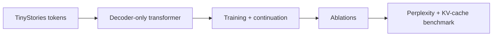

# Architecture

```mermaid
flowchart LR
    N0["TinyStories tokens"] --> N1["Decoder-only transformer"]
    N1["Decoder-only transformer"] --> N2["Training + continuation"]
    N2["Training + continuation"] --> N3["Ablations"]
    N3["Ablations"] --> N4["Perplexity + KV-cache benchmark"]
    N4["Perplexity + KV-cache benchmark"]
```

## Claim boundary

Real small-model training and local KV-cache benchmark; not a frontier-scale LLM.
