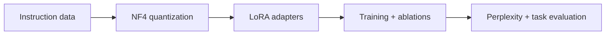

# Architecture

```mermaid
flowchart LR
    N0["Instruction data"] --> N1["NF4 quantization"]
    N1["NF4 quantization"] --> N2["LoRA adapters"]
    N2["LoRA adapters"] --> N3["Training + ablations"]
    N3["Training + ablations"] --> N4["Perplexity + task evaluation"]
    N4["Perplexity + task evaluation"]
```

## Claim boundary

Real single-GPU fine-tuning and evaluation; downstream benchmark result is mixed and documented.
