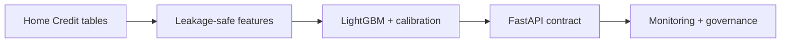

# Architecture

```mermaid
flowchart LR
    N0["Home Credit tables"] --> N1["Leakage-safe features"]
    N1["Leakage-safe features"] --> N2["LightGBM + calibration"]
    N2["LightGBM + calibration"] --> N3["FastAPI contract"]
    N3["FastAPI contract"] --> N4["Monitoring + governance"]
    N4["Monitoring + governance"]
```

## Claim boundary

Real public data; local API load test; no claim of internet-scale production traffic.
